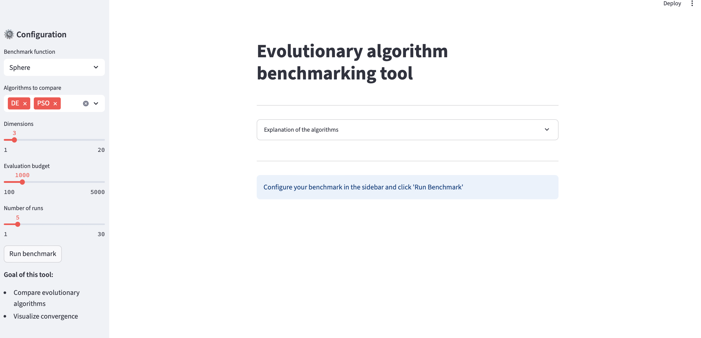
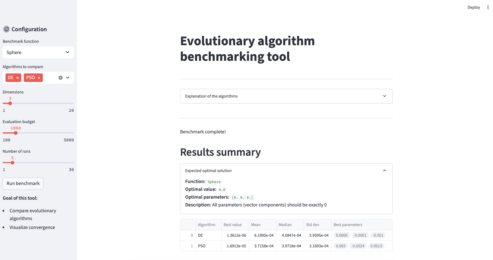

# Warmup web app for evolutionary algorithms

## Prerequisites

Before running this web application, make sure you have the following Python libraries installed:

```bash
pip3 install streamlit numpy pandas plotly nevergrad
```

After installing the prerequisites, hit the run button (or use the command below) and follow the instructions in the terminal:

```bash
streamlit run <your_app_file>.py
```

## How to use The evolutionary algorithm benchmarking tool

1. **Select Benchmark Function**  
   Choose a mathematical optimization function (for example *Sphere*) from the dropdown.

2. **Choose Algorithms to Compare**  
   Select one or more evolutionary algorithms (for example DE, PSO, GeneticDE). You can easily extend the app by adding more algorithms. To view all available optimizers provided by `nevergrad`, run the following command in Python:

```python
print(sorted(ng.optimizers.registry.keys()))
```

3. **Set Parameters**  
   - **Dimensions**: Number of variables (1–20).  
   - **Evaluation budget**: Max number of function evaluations (100–5000).  
   - **Number of runs**: How many independent runs to perform (1–30).

4. **Run the Benchmark**  
   Click the **"Run benchmark"** button and wait for the results.

5. **Review Results**  
   - **Results summary**: Shows best/mean/median performance across runs.  
   - **Convergence analysis**: Visual graph of average performance over evaluations.  
   - Expand sections for detailed results of each algorithm.

> The goal is to **compare the performance** of evolutionary algorithms and **visualize their convergence behavior**.

You can also read a simple description of each algorithm by expanding the **"Explanation of the algorithms"** section at the top of the app.



